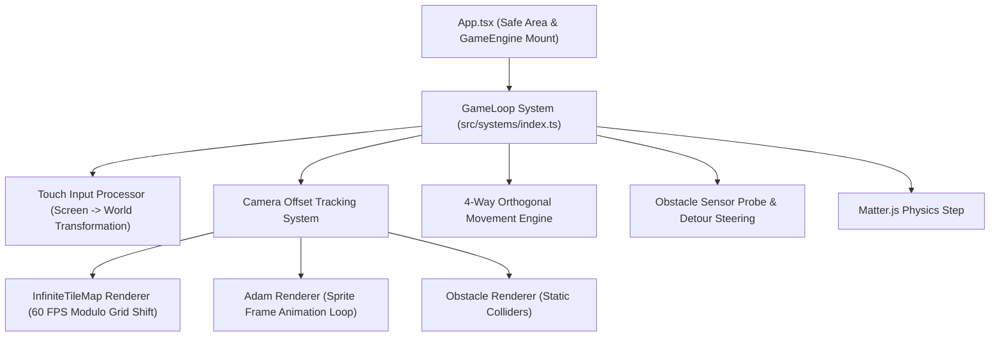

# Move Engine 🚀

A **2D Top-Down Infinite Canvas Game Engine** built with **React Native**, **Expo SDK 57**, **`react-native-game-engine`**, and **`Matter.js`**.

The engine renders an infinite terrain grid at a lock 60 FPS, supporting 4-way cardinal orthogonal player movement, sprite-based character animations, static obstacle physics, and intelligent detour obstacle avoidance.

---

## 🌟 Key Features

- ♾️ **60 FPS Infinite Tile Canvas**: Virtualized static grid tile streamer utilizing modulo shift translation to eliminate VDOM churn.
- 🚶 **4-Way Orthogonal Movement**: Lock-axis L-shaped pathing (left, up, right, down) enforcing clean cardinal navigation.
- 🎨 **48-Frame Sprite Animation Engine**: Directional sprite loop handling `idle` and `run` states for all 4 cardinal directions.
- 🛡️ **Physics & Detour Steering**: Static collider bodies (rocks, trees, walls) paired with 4px spatial sensor probes that steer around obstacles.
- 📐 **Camera World Transformation**: Dynamic screen-to-world touch target conversion keeping the player locked at the screen center.

---

## 🚀 Getting Started

### Prerequisites

- Node.js (v18 or higher recommended)
- Expo Go app on iOS/Android, or local iOS Simulator / Android Emulator

### Installation

1. Install project dependencies:
   ```bash
   npm install
   ```

2. Start the development server:
   ```bash
   npx expo start
   ```

### Verification & Quality Checks

Run TypeScript compiler check and Expo health diagnostic:
```bash
# Verify TypeScript types (0 errors)
npx tsc --noEmit

# Run Expo health check (21/21 checks)
npx expo-doctor
```

---

## 🏗️ System Architecture



---

## 📁 File Registry & Module Responsibilities

| File Path | Core Responsibility | Primary Exports / Functions |
|---|---|---|
| [`App.tsx`](file:///Users/ayobami/code/Personals/move/App.tsx) | Application entry point & Safe View setup | `App()`, `SafeView()` |
| [`src/types.ts`](file:///Users/ayobami/code/Personals/move/src/types.ts) | Central TypeScript type definitions & contracts | `GameEntity`, `AnimationState`, `Direction`, `Camera`, `Position2D`, `GameEngineEntities` |
| [`src/entities/index.ts`](file:///Users/ayobami/code/Personals/move/src/entities/index.ts) | Entity instantiation factory & physics world bootstrap | `entities()` |
| [`src/entities/Adam.tsx`](file:///Users/ayobami/code/Personals/move/src/entities/Adam.tsx) | Character renderer & 48-frame animation loop manager | `Adam()`, `ANIMATIONS` map |
| [`src/entities/InfiniteTileMap.tsx`](file:///Users/ayobami/code/Personals/move/src/entities/InfiniteTileMap.tsx) | 60 FPS endless tilemap renderer using modulo shift | `InfiniteTileMap()`, `StaticGrid` |
| [`src/entities/Obstacle.tsx`](file:///Users/ayobami/code/Personals/move/src/entities/Obstacle.tsx) | Static physics colliders (rocks, trees, walls) | `Obstacle()` |
| [`src/systems/index.ts`](file:///Users/ayobami/code/Personals/move/src/systems/index.ts) | Primary Game Loop system: input, camera, movement & detour | `GameLoop()`, `isPathBlocked()`, `isPointInsideObstacle()`, `getOpenDetourDirection()` |
| [`src/utils.ts`](file:///Users/ayobami/code/Personals/move/src/utils.ts) | Screen dimension utilities | `windowWidth`, `windowHeight` |
| [`src/global.d.ts`](file:///Users/ayobami/code/Personals/move/src/global.d.ts) | Global TypeScript environment declarations | `declare global` variable augmentations |

---

## 🔬 Detailed Technical Design

### 1. Viewport Virtualization & 60 FPS TileMap
- **Location**: [`src/entities/InfiniteTileMap.tsx`](file:///Users/ayobami/code/Personals/move/src/entities/InfiniteTileMap.tsx)
- **Design**: To avoid creating hundreds of React `<Image>` VDOM elements per frame, the component memoizes a fixed 70-tile grid `(screenCols + 2) × (screenRows + 2)`.
- **Modulo Shift Math**:
  ```text
  shiftX = ((cameraX % TILE_SIZE) + TILE_SIZE) % TILE_SIZE - TILE_SIZE
  shiftY = ((cameraY % TILE_SIZE) + TILE_SIZE) % TILE_SIZE - TILE_SIZE
  ```

### 2. Camera Offset & Coordinate System
- **Location**: [`src/systems/index.ts`](file:///Users/ayobami/code/Personals/move/src/systems/index.ts#L58-L60)
- **Offset Math**:
  ```text
  cameraX = (windowWidth / 2) - adamWorldX
  cameraY = (windowHeight / 2) - adamWorldY
  ```
- **Touch Transformation**:
  ```text
  worldTargetX = screenX - cameraX
  worldTargetY = screenY - cameraY
  ```

### 3. Orthogonal 4-Way L-Shaped Movement System
- **Location**: [`src/systems/index.ts`](file:///Users/ayobami/code/Personals/move/src/systems/index.ts#L110-L200)
- Enforces strict cardinal directions (`left`, `up`, `right`, `down`) without diagonal movement.
- Locks onto a primary axis (`activeAxis = "horizontal"` or `"vertical"`), moving in a straight line until aligned before turning.
- Body rotation is locked (`inertia: Infinity`).

### 4. Sensor Probes & Target-Aware Sticky Detour Steering
- **Location**: [`src/systems/index.ts`](file:///Users/ayobami/code/Personals/move/src/systems/index.ts#L48-L95)
- **Taps on Obstacles**: `isPointInsideObstacle` ignores taps landing directly on solid colliders.
- **Sensor Probes**: `isPathBlocked` checks 4px ahead of Adam's 32x48 bounding box using `Matter.Query.region`.
- **Target-Aware Detour Selection**: When forward movement is blocked, `getOpenDetourDirection()` evaluates candidate detour directions sorted by proximity to `targetPosition` (e.g. preferring `down` over `up` if `targetY` is below).
- **Detour Direction Locking & Loop Prevention**:
  - Locks `adamEntity.detourDirection` to maintain a sticky detour trajectory around corners.
  - Maintains `adamEntity.blockedDetours` array to blacklist failed/blocked detour paths, eliminating back-and-forth oscillation when boxed in.
- **Stuck Guard**: Resets state to `"idle"` and clears target if stationary for $>10$ frame ticks.

---

## ⚖️ Architectural Trade-Offs

1. **State Mutation in Game Systems vs. Pure Reducers**:
   - Direct entity mutations inside high-frequency game ticks avoid garbage collection overhead, preserving a consistent 60 FPS frame rate.
2. **Target-Aware Sticky Detour Probing vs. Full A* Graph Pathfinding**:
   - $O(1)$ constant-time target-aware detour probing with sticky direction locking avoids the heavy $O(V \log V)$ memory and CPU overhead of full A* graph search while guaranteeing zero backtracking loops.

---

## 🛠️ Future Refactoring & Improvements

1. **Modular System Decomposition**:
   Split [`src/systems/index.ts`](file:///Users/ayobami/code/Personals/move/src/systems/index.ts) into discrete single-responsibility files (`InputSystem`, `CameraSystem`, `MovementSystem`, `AvoidanceSystem`, `PhysicsSystem`).
2. **Input Abstraction**:
   Extend input handler to support keyboard WASD and virtual touch joysticks.

---

## 📄 License

MIT
